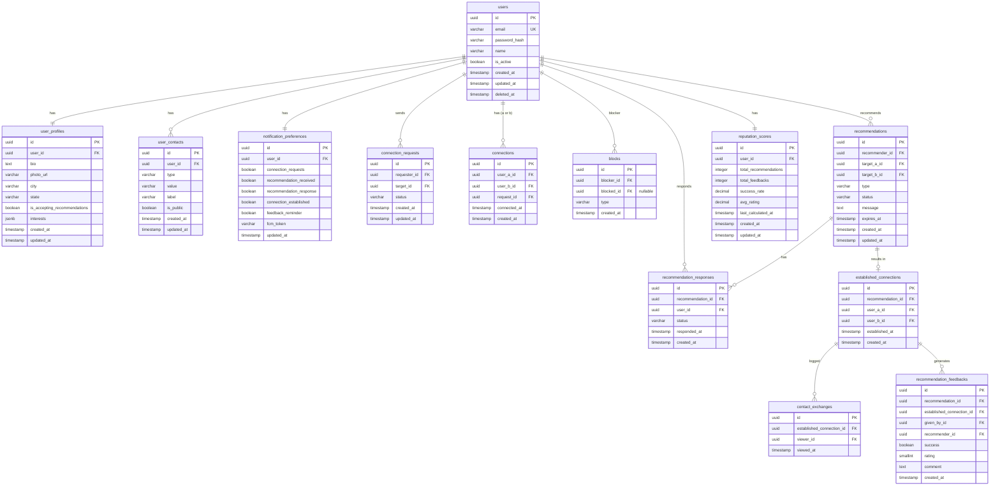

# LinkUp — Database Design

> Fonte de verdade para modelagem de dados.
> Stack: PostgreSQL · Entity Framework Core (.NET 10) · Redis

---

## 1. Diagrama ERD (Mermaid)



---

## 2. Schema Completo

### users

```sql
CREATE TABLE users (
    id            UUID PRIMARY KEY DEFAULT gen_random_uuid(),
    email         VARCHAR(255) NOT NULL,
    password_hash VARCHAR(255) NOT NULL,
    name          VARCHAR(100) NOT NULL,
    is_active     BOOLEAN NOT NULL DEFAULT true,
    created_at    TIMESTAMPTZ NOT NULL DEFAULT NOW(),
    updated_at    TIMESTAMPTZ NOT NULL DEFAULT NOW(),
    deleted_at    TIMESTAMPTZ NULL -- soft delete
);

-- LGPD: ao deletar conta, anonimizar PII
-- email → 'deleted_{id}@anonymized.linkup'
-- name  → 'Usuário Removido'
-- password_hash → ''
-- deleted_at → NOW()

CREATE UNIQUE INDEX uix_users_email
    ON users (email)
    WHERE deleted_at IS NULL;

CREATE INDEX ix_users_deleted_at ON users (deleted_at)
    WHERE deleted_at IS NULL;
```

---

### user_profiles

```sql
CREATE TABLE user_profiles (
    id                           UUID PRIMARY KEY DEFAULT gen_random_uuid(),
    user_id                      UUID NOT NULL REFERENCES users(id) ON DELETE CASCADE,
    bio                          TEXT NULL,
    photo_url                    VARCHAR(500) NULL,
    city                         VARCHAR(100) NULL,
    state                        CHAR(2) NULL,         -- UF (SP, RJ, etc.)
    is_accepting_recommendations BOOLEAN NOT NULL DEFAULT true,
    interests                    JSONB NOT NULL DEFAULT '[]',  -- array de strings
    created_at                   TIMESTAMPTZ NOT NULL DEFAULT NOW(),
    updated_at                   TIMESTAMPTZ NOT NULL DEFAULT NOW()
);

CREATE UNIQUE INDEX uix_user_profiles_user_id ON user_profiles (user_id);
CREATE INDEX ix_user_profiles_state_city ON user_profiles (state, city)
    WHERE state IS NOT NULL;
CREATE INDEX ix_user_profiles_accepting ON user_profiles (is_accepting_recommendations)
    WHERE is_accepting_recommendations = true;
```

---

### user_contacts

```sql
CREATE TYPE contact_type AS ENUM (
    'PHONE', 'EMAIL', 'INSTAGRAM', 'LINKEDIN', 'WHATSAPP', 'OTHER'
);

CREATE TABLE user_contacts (
    id         UUID PRIMARY KEY DEFAULT gen_random_uuid(),
    user_id    UUID NOT NULL REFERENCES users(id) ON DELETE CASCADE,
    type       contact_type NOT NULL,
    value      VARCHAR(255) NOT NULL,
    label      VARCHAR(100) NULL,
    is_public  BOOLEAN NOT NULL DEFAULT true,
    created_at TIMESTAMPTZ NOT NULL DEFAULT NOW(),
    updated_at TIMESTAMPTZ NOT NULL DEFAULT NOW()
);

CREATE INDEX ix_user_contacts_user_id ON user_contacts (user_id);
```

---

### notification_preferences

```sql
CREATE TABLE notification_preferences (
    id                      UUID PRIMARY KEY DEFAULT gen_random_uuid(),
    user_id                 UUID NOT NULL REFERENCES users(id) ON DELETE CASCADE,
    connection_requests     BOOLEAN NOT NULL DEFAULT true,
    recommendation_received BOOLEAN NOT NULL DEFAULT true,
    recommendation_response BOOLEAN NOT NULL DEFAULT true,
    connection_established  BOOLEAN NOT NULL DEFAULT true,
    feedback_reminder       BOOLEAN NOT NULL DEFAULT true,
    fcm_token               VARCHAR(500) NULL,
    updated_at              TIMESTAMPTZ NOT NULL DEFAULT NOW()
);

CREATE UNIQUE INDEX uix_notification_preferences_user_id ON notification_preferences (user_id);
```

---

### connection_requests

```sql
CREATE TYPE connection_request_status AS ENUM (
    'PENDING', 'ACCEPTED', 'REJECTED'
);

CREATE TABLE connection_requests (
    id           UUID PRIMARY KEY DEFAULT gen_random_uuid(),
    requester_id UUID NOT NULL REFERENCES users(id),
    target_id    UUID NOT NULL REFERENCES users(id),
    status       connection_request_status NOT NULL DEFAULT 'PENDING',
    created_at   TIMESTAMPTZ NOT NULL DEFAULT NOW(),
    updated_at   TIMESTAMPTZ NOT NULL DEFAULT NOW(),

    CONSTRAINT chk_connection_requests_different_users
        CHECK (requester_id <> target_id)
);

-- Impede duplicatas de solicitação pendente
CREATE UNIQUE INDEX uix_connection_requests_pending
    ON connection_requests (requester_id, target_id)
    WHERE status = 'PENDING';

CREATE INDEX ix_connection_requests_target_pending
    ON connection_requests (target_id, status)
    WHERE status = 'PENDING';

CREATE INDEX ix_connection_requests_requester ON connection_requests (requester_id);
```

---

### connections

```sql
CREATE TABLE connections (
    id             UUID PRIMARY KEY DEFAULT gen_random_uuid(),
    user_a_id      UUID NOT NULL REFERENCES users(id),
    user_b_id      UUID NOT NULL REFERENCES users(id),
    request_id     UUID NOT NULL REFERENCES connection_requests(id),
    connected_at   TIMESTAMPTZ NOT NULL DEFAULT NOW(),
    created_at     TIMESTAMPTZ NOT NULL DEFAULT NOW(),

    CONSTRAINT chk_connections_different_users
        CHECK (user_a_id <> user_b_id),
    -- Garantia: user_a_id < user_b_id para evitar duplicata inversa
    CONSTRAINT chk_connections_ordered
        CHECK (user_a_id < user_b_id)
);

-- Unicidade da conexão (bidirecional via constraint ordenada)
CREATE UNIQUE INDEX uix_connections_pair ON connections (user_a_id, user_b_id);

-- Busca por usuário em qualquer lado
CREATE INDEX ix_connections_user_a ON connections (user_a_id);
CREATE INDEX ix_connections_user_b ON connections (user_b_id);
```

> **Nota:** Ao criar connection, sempre armazenar `user_a_id = MIN(userX, userY)` e `user_b_id = MAX(userX, userY)` para garantir unicidade bidirecional.

---

### blocks

```sql
CREATE TYPE block_type AS ENUM (
    'BLOCK_BY_USER',  -- bloqueia usuário específico de indicar
    'DISABLE_ALL'     -- desativa completamente ser indicado
);

CREATE TABLE blocks (
    id          UUID PRIMARY KEY DEFAULT gen_random_uuid(),
    blocker_id  UUID NOT NULL REFERENCES users(id) ON DELETE CASCADE,
    blocked_id  UUID NULL REFERENCES users(id) ON DELETE CASCADE,  -- NULL se DISABLE_ALL
    type        block_type NOT NULL,
    created_at  TIMESTAMPTZ NOT NULL DEFAULT NOW(),

    CONSTRAINT chk_blocks_user_required_when_block_by_user
        CHECK (
            (type = 'BLOCK_BY_USER' AND blocked_id IS NOT NULL) OR
            (type = 'DISABLE_ALL'   AND blocked_id IS NULL)
        ),
    CONSTRAINT chk_blocks_different_users
        CHECK (blocker_id <> blocked_id)
);

-- Unicidade: um blocker só tem um DISABLE_ALL ativo
CREATE UNIQUE INDEX uix_blocks_disable_all
    ON blocks (blocker_id)
    WHERE type = 'DISABLE_ALL';

-- Unicidade: blocker só bloqueia mesmo usuário uma vez
CREATE UNIQUE INDEX uix_blocks_by_user
    ON blocks (blocker_id, blocked_id)
    WHERE type = 'BLOCK_BY_USER' AND blocked_id IS NOT NULL;

CREATE INDEX ix_blocks_blocker ON blocks (blocker_id);
CREATE INDEX ix_blocks_blocked ON blocks (blocked_id) WHERE blocked_id IS NOT NULL;
```

---

### recommendations

```sql
CREATE TYPE recommendation_type AS ENUM (
    'FRIENDSHIP', 'ROMANCE', 'PROFESSIONAL', 'MENTORSHIP', 'PARTNERSHIP'
);

CREATE TYPE recommendation_status AS ENUM (
    'PENDING',             -- nenhum respondeu
    'PARTIALLY_ACCEPTED',  -- um aceitou, outro pendente
    'ACCEPTED',            -- ambos aceitaram
    'REJECTED',            -- ao menos um rejeitou
    'EXPIRED',             -- 30 dias sem resposta
    'CANCELLED'            -- cancelado pelo recommender (futuro)
);

CREATE TABLE recommendations (
    id              UUID PRIMARY KEY DEFAULT gen_random_uuid(),
    recommender_id  UUID NOT NULL REFERENCES users(id),
    target_a_id     UUID NOT NULL REFERENCES users(id),
    target_b_id     UUID NOT NULL REFERENCES users(id),
    type            recommendation_type NOT NULL,
    status          recommendation_status NOT NULL DEFAULT 'PENDING',
    message         TEXT NULL,           -- max 300 chars (validado na app layer)
    expires_at      TIMESTAMPTZ NOT NULL, -- created_at + 30 days
    created_at      TIMESTAMPTZ NOT NULL DEFAULT NOW(),
    updated_at      TIMESTAMPTZ NOT NULL DEFAULT NOW(),

    CONSTRAINT chk_recommendations_different_targets
        CHECK (target_a_id <> target_b_id),
    CONSTRAINT chk_recommendations_recommender_not_target
        CHECK (recommender_id <> target_a_id AND recommender_id <> target_b_id),
    -- Ordenar targets para evitar duplicata inversa
    CONSTRAINT chk_recommendations_targets_ordered
        CHECK (target_a_id < target_b_id)
);

-- Impede recomendação duplicada pendente entre mesmo par pelo mesmo recommender
CREATE UNIQUE INDEX uix_recommendations_pending_pair
    ON recommendations (recommender_id, target_a_id, target_b_id)
    WHERE status IN ('PENDING', 'PARTIALLY_ACCEPTED');

-- Busca por destinatário
CREATE INDEX ix_recommendations_target_a ON recommendations (target_a_id, status);
CREATE INDEX ix_recommendations_target_b ON recommendations (target_b_id, status);
CREATE INDEX ix_recommendations_recommender ON recommendations (recommender_id);

-- Job de expiração
CREATE INDEX ix_recommendations_expires_at
    ON recommendations (expires_at)
    WHERE status IN ('PENDING', 'PARTIALLY_ACCEPTED');
```

---

### recommendation_responses

```sql
CREATE TYPE recommendation_response_status AS ENUM (
    'PENDING', 'ACCEPTED', 'REJECTED'
);

CREATE TABLE recommendation_responses (
    id                UUID PRIMARY KEY DEFAULT gen_random_uuid(),
    recommendation_id UUID NOT NULL REFERENCES recommendations(id),
    user_id           UUID NOT NULL REFERENCES users(id),
    status            recommendation_response_status NOT NULL DEFAULT 'PENDING',
    responded_at      TIMESTAMPTZ NULL,
    created_at        TIMESTAMPTZ NOT NULL DEFAULT NOW()
);

CREATE UNIQUE INDEX uix_recommendation_responses_rec_user
    ON recommendation_responses (recommendation_id, user_id);

CREATE INDEX ix_recommendation_responses_user_pending
    ON recommendation_responses (user_id, status)
    WHERE status = 'PENDING';
```

---

### established_connections

```sql
CREATE TABLE established_connections (
    id                UUID PRIMARY KEY DEFAULT gen_random_uuid(),
    recommendation_id UUID NOT NULL REFERENCES recommendations(id),
    user_a_id         UUID NOT NULL REFERENCES users(id),
    user_b_id         UUID NOT NULL REFERENCES users(id),
    established_at    TIMESTAMPTZ NOT NULL DEFAULT NOW(),
    created_at        TIMESTAMPTZ NOT NULL DEFAULT NOW(),

    CONSTRAINT chk_established_connections_ordered
        CHECK (user_a_id < user_b_id)
);

CREATE UNIQUE INDEX uix_established_connections_recommendation
    ON established_connections (recommendation_id);

CREATE UNIQUE INDEX uix_established_connections_pair
    ON established_connections (user_a_id, user_b_id);

CREATE INDEX ix_established_connections_user_a ON established_connections (user_a_id);
CREATE INDEX ix_established_connections_user_b ON established_connections (user_b_id);
```

---

### contact_exchanges

```sql
CREATE TABLE contact_exchanges (
    id                        UUID PRIMARY KEY DEFAULT gen_random_uuid(),
    established_connection_id UUID NOT NULL REFERENCES established_connections(id),
    viewer_id                 UUID NOT NULL REFERENCES users(id),
    viewed_at                 TIMESTAMPTZ NOT NULL DEFAULT NOW()
);

-- Um usuário pode visualizar contatos apenas uma vez por conexão (registro de evento)
CREATE UNIQUE INDEX uix_contact_exchanges_conn_viewer
    ON contact_exchanges (established_connection_id, viewer_id);
```

---

### recommendation_feedbacks

```sql
CREATE TABLE recommendation_feedbacks (
    id                        UUID PRIMARY KEY DEFAULT gen_random_uuid(),
    recommendation_id         UUID NOT NULL REFERENCES recommendations(id),
    established_connection_id UUID NOT NULL REFERENCES established_connections(id),
    given_by_id               UUID NOT NULL REFERENCES users(id),
    recommender_id            UUID NOT NULL REFERENCES users(id),
    success                   BOOLEAN NOT NULL,
    rating                    SMALLINT NOT NULL,
    comment                   TEXT NULL,         -- max 200 chars
    created_at                TIMESTAMPTZ NOT NULL DEFAULT NOW(),

    CONSTRAINT chk_feedback_rating_range CHECK (rating BETWEEN 1 AND 5)
);

-- Cada usuário dá apenas um feedback por recomendação
CREATE UNIQUE INDEX uix_recommendation_feedbacks_rec_user
    ON recommendation_feedbacks (recommendation_id, given_by_id);

-- Score calculation
CREATE INDEX ix_recommendation_feedbacks_recommender
    ON recommendation_feedbacks (recommender_id);
```

---

### reputation_scores

```sql
CREATE TABLE reputation_scores (
    id                   UUID PRIMARY KEY DEFAULT gen_random_uuid(),
    user_id              UUID NOT NULL REFERENCES users(id) ON DELETE CASCADE,
    total_recommendations INTEGER NOT NULL DEFAULT 0,
    total_feedbacks       INTEGER NOT NULL DEFAULT 0,
    success_rate          DECIMAL(5,4) NOT NULL DEFAULT 0,  -- 0.0000 a 1.0000
    avg_rating            DECIMAL(3,2) NOT NULL DEFAULT 0,  -- 0.00 a 5.00
    last_calculated_at   TIMESTAMPTZ NOT NULL DEFAULT NOW(),
    created_at           TIMESTAMPTZ NOT NULL DEFAULT NOW(),
    updated_at           TIMESTAMPTZ NOT NULL DEFAULT NOW()
);

CREATE UNIQUE INDEX uix_reputation_scores_user_id ON reputation_scores (user_id);

-- Ranking
CREATE INDEX ix_reputation_scores_avg_rating ON reputation_scores (avg_rating DESC)
    WHERE total_feedbacks >= 3;  -- só entra no ranking com mínimo de feedbacks
```

---

## 3. Queries Críticas

### Verificar se recommender está conectado a ambos os targets

```sql
-- Retorna true se recommender tem conexão ACCEPTED com AMBOS target_a e target_b
SELECT
    COUNT(*) FILTER (WHERE
        (user_a_id = $recommender_id AND user_b_id = $target_a_id) OR
        (user_a_id = $target_a_id    AND user_b_id = $recommender_id)
    ) >= 1 AS connected_to_a,
    COUNT(*) FILTER (WHERE
        (user_a_id = $recommender_id AND user_b_id = $target_b_id) OR
        (user_a_id = $target_b_id    AND user_b_id = $recommender_id)
    ) >= 1 AS connected_to_b
FROM connections
WHERE
    (
        (user_a_id = LEAST($recommender_id, $target_a_id)    AND user_b_id = GREATEST($recommender_id, $target_a_id)) OR
        (user_a_id = LEAST($recommender_id, $target_b_id)    AND user_b_id = GREATEST($recommender_id, $target_b_id))
    );
```

### Verificar bloqueios antes de criar recomendação

```sql
SELECT EXISTS (
    SELECT 1 FROM blocks
    WHERE blocker_id = $target_id
      AND (
          type = 'DISABLE_ALL' OR
          (type = 'BLOCK_BY_USER' AND blocked_id = $recommender_id)
      )
) AS is_blocked;
```

### Recomendações recebidas pendentes (com perfil completo do outro)

```sql
SELECT
    r.id,
    r.type,
    r.status,
    r.message,
    r.expires_at,
    r.created_at,
    rr.status AS my_response,

    -- Quem recomendou
    rec_user.id       AS recommender_id,
    rec_user.name     AS recommender_name,
    rec_prof.photo_url AS recommender_photo,

    -- Outro usuário (não sou eu)
    CASE WHEN r.target_a_id = $user_id THEN other_user.id    ELSE other_user.id    END AS other_id,
    CASE WHEN r.target_a_id = $user_id THEN other_user.name  ELSE other_user.name  END AS other_name,
    other_prof.photo_url,
    other_prof.bio,
    other_prof.interests,
    other_prof.city,
    other_prof.state

FROM recommendations r
JOIN recommendation_responses rr
    ON rr.recommendation_id = r.id AND rr.user_id = $user_id
JOIN users rec_user ON rec_user.id = r.recommender_id
JOIN user_profiles rec_prof ON rec_prof.user_id = r.recommender_id
JOIN users other_user ON other_user.id =
    CASE WHEN r.target_a_id = $user_id THEN r.target_b_id ELSE r.target_a_id END
JOIN user_profiles other_prof ON other_prof.user_id = other_user.id
WHERE rr.status = 'PENDING'
  AND r.status IN ('PENDING', 'PARTIALLY_ACCEPTED')
  AND r.expires_at > NOW()
ORDER BY r.created_at DESC
LIMIT $page_size OFFSET $offset;
```

### Calcular reputação após novo feedback

```sql
UPDATE reputation_scores
SET
    total_feedbacks = (
        SELECT COUNT(*) FROM recommendation_feedbacks WHERE recommender_id = $recommender_id
    ),
    total_recommendations = (
        SELECT COUNT(*) FROM recommendations WHERE recommender_id = $recommender_id
          AND status = 'ACCEPTED'
    ),
    success_rate = (
        SELECT COALESCE(AVG(success::int), 0)
        FROM recommendation_feedbacks WHERE recommender_id = $recommender_id
    ),
    avg_rating = (
        SELECT COALESCE(AVG(rating), 0)
        FROM recommendation_feedbacks WHERE recommender_id = $recommender_id
    ),
    last_calculated_at = NOW(),
    updated_at = NOW()
WHERE user_id = $recommender_id;
```

### Job: expirar recomendações

```sql
UPDATE recommendations
SET status = 'EXPIRED', updated_at = NOW()
WHERE status IN ('PENDING', 'PARTIALLY_ACCEPTED')
  AND expires_at < NOW()
RETURNING id, recommender_id, target_a_id, target_b_id;
-- IDs retornados para envio de notificações
```

### Ranking de reputação

```sql
SELECT
    u.id,
    u.name,
    up.photo_url,
    up.city,
    up.state,
    rs.avg_rating,
    rs.success_rate,
    rs.total_recommendations,
    rs.total_feedbacks
FROM reputation_scores rs
JOIN users u ON u.id = rs.user_id
JOIN user_profiles up ON up.user_id = rs.user_id
WHERE rs.total_feedbacks >= 3
  AND u.deleted_at IS NULL
ORDER BY rs.avg_rating DESC, rs.success_rate DESC
LIMIT 50;
```

---

## 4. Ordem de Criação das Migrations

```
001_CreateUsers
002_CreateUserProfiles
003_CreateUserContacts
004_CreateNotificationPreferences
005_CreateConnectionRequests
006_CreateConnections
007_CreateBlocks
008_CreateRecommendations
009_CreateRecommendationResponses
010_CreateEstablishedConnections
011_CreateContactExchanges
012_CreateRecommendationFeedbacks
013_CreateReputationScores
014_SeedDefaultData  -- criar reputation_score para todo novo usuário via trigger
```

### Trigger: criar reputation_score ao registrar usuário

```sql
CREATE OR REPLACE FUNCTION create_reputation_score_for_new_user()
RETURNS TRIGGER AS $$
BEGIN
    INSERT INTO reputation_scores (user_id)
    VALUES (NEW.id)
    ON CONFLICT DO NOTHING;
    RETURN NEW;
END;
$$ LANGUAGE plpgsql;

CREATE TRIGGER trg_create_reputation_score
AFTER INSERT ON users
FOR EACH ROW EXECUTE FUNCTION create_reputation_score_for_new_user();
```

---

## 5. Estratégia de Soft Delete

**Regra:** nunca deletar fisicamente dados de usuário.

Ao usuário solicitar exclusão de conta (LGPD — direito ao esquecimento):

```sql
UPDATE users SET
    email         = 'deleted_' || id || '@anonymized.linkup',
    name          = 'Usuário Removido',
    password_hash = '',
    is_active     = false,
    deleted_at    = NOW(),
    updated_at    = NOW()
WHERE id = $user_id;

UPDATE user_profiles SET
    bio       = NULL,
    photo_url = NULL,
    city      = NULL,
    state     = NULL,
    interests = '[]',
    updated_at = NOW()
WHERE user_id = $user_id;

DELETE FROM user_contacts WHERE user_id = $user_id;
-- contatos são PII — deletar fisicamente
```

**Global Query Filter EF Core** (aplicar em todas as queries):
```csharp
modelBuilder.Entity<User>().HasQueryFilter(u => u.DeletedAt == null);
```

---

## 6. Considerações LGPD

| Dado | Classificação | Tratamento |
|------|--------------|-----------|
| Email | PII | Anonimizar em soft delete |
| Nome | PII | Substituir em soft delete |
| Foto | PII | Remover URL em soft delete |
| Telefone/contatos | PII sensível | Deletar fisicamente ao excluir conta |
| Bio | PII | Limpar em soft delete |
| Localização | PII | Limpar em soft delete |
| Feedbacks | Dado comportamental | Manter anonimizado (sem PII) |
| Logs | Operacional | Não logar PII; purgar após 90 dias |

---

## 7. Estratégia Redis

| Key | Tipo | Dados | TTL | Invalidação |
|-----|------|-------|-----|-------------|
| `user:profile:{userId}` | String (JSON) | UserProfileDto completo | 5 min | PATCH /users/me/profile |
| `user:reputation:{userId}` | String (JSON) | ReputationDto | 10 min | Novo feedback recebido |
| `rt:{userId}:{tokenId}` | String | Hash do refresh token | 30 dias | Logout / rotação |
| `connections:{userId}` | String (JSON) | Lista de connectionIds | 2 min | Nova connection aceita |
| `block:check:{targetId}:{recommenderId}` | String | "1" se bloqueado | 5 min | Bloco adicionado/removido |
| `lock:rec:{minId}:{maxId}` | String | "1" | 10 seg | Auto-expira |

**Distributed Lock — Race Condition no aceite mútuo:**
```
Key: lock:rec:{min(targetA,targetB)}:{max(targetA,targetB)}
TTL: 10 segundos
Usar SETNX + EXPIRE antes de verificar respostas e criar EstablishedConnection
```
